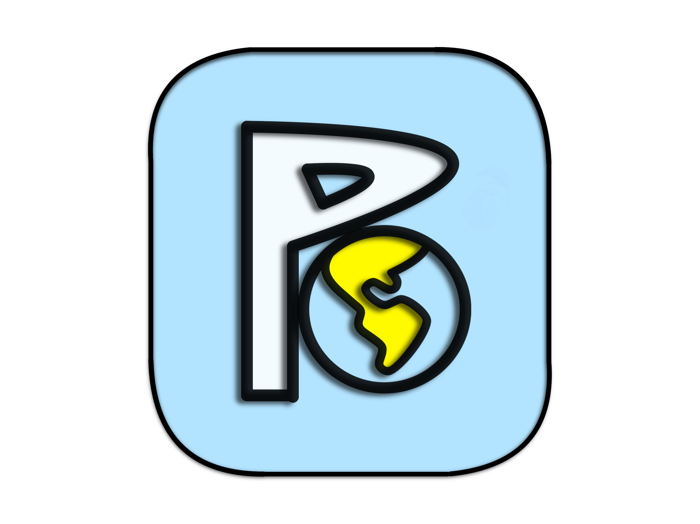
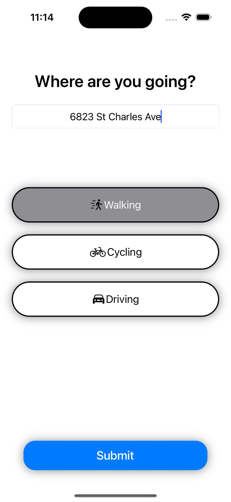
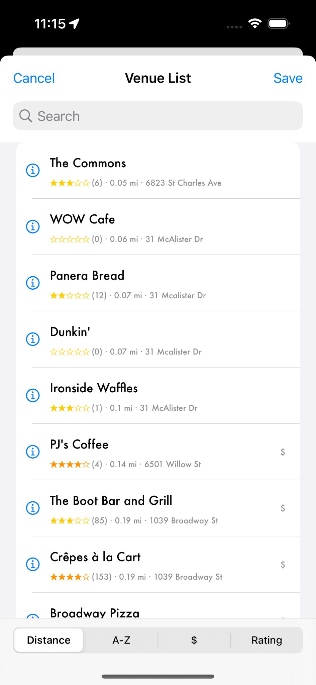
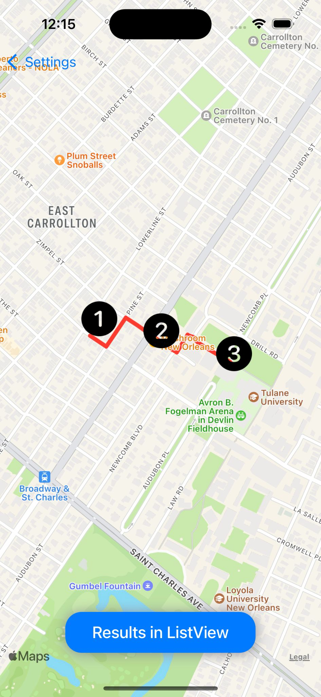
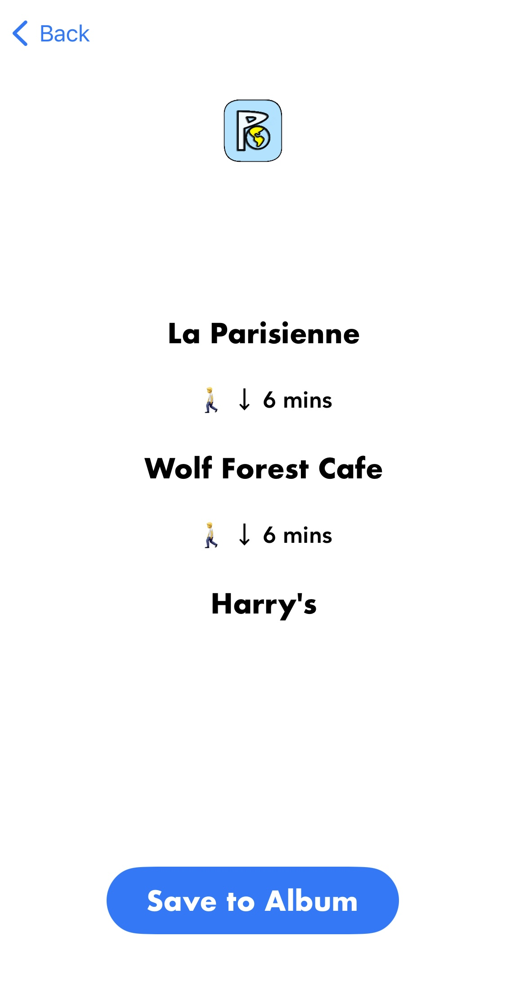

# PlanItCapstone

PlanIt is the ultimate travel planning and route-finding companion iOS application built using Swift, YelpAPI, MapKit, and UIStoryboard.

**Developing Approach**
- Developed using MVVM-C architecture
- Algorithm that can pick the fastest route between all POIs using exhaustive search
- Using YelpAPI and Apple MapKit into the application to support user flexibility and application accuracy

**Functionalities**
- Feature User Choice by allowing user to choose vacation destination and points of interest(via search & categories)
- Functional map feature to display the routes (via walking, driving, or transit) to the user

  
  
   
  
  

**Feature Highlights**
- Result page listing transport time and optimized route
- Address page with automatch address / current location option if the address entered is not recognizable
- Venue page presents deatailed venue info including rating, distance between the user and the venue and address
- Dark / Light mode
- User designated Start / End point
- Hide Venues from the list by swiping left
- Search / Sort Venues within categories alphabetically or with price / distance/ Rating
- Search categories w/ Yelp API

*Updated Oct 31th, 2023*
